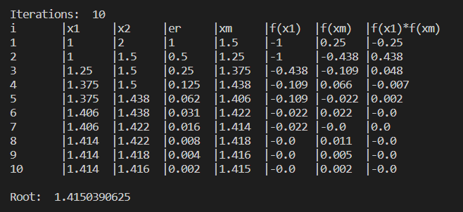
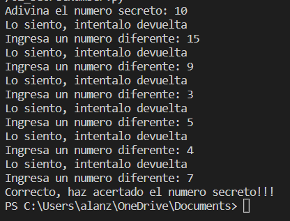
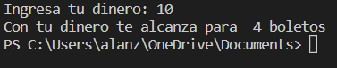
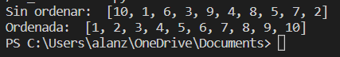
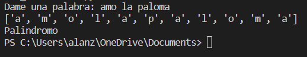
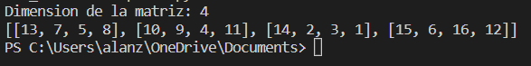

  <h2>Contenidos</h2>
  

    
Ejerció 1 Bisección

    
El ejercicio era pasar el programa anteriormente realizado en c++ a python.

    
  

  

    
Ejerció 2 Secret Number

    
El ejercicio trata sobre adivinar el número secreto que es aleatorio.

    
  

  
  

    
Ejerció 3 Ticket

    
El ejercicio es sobre pedir cierta cantidad de dinero e mostrar cuantos boletos le alcanza al usuario, pero cada ticket que compras su precio aumenta.

    
  

  
  

    
Ejerció 4 Bubbel Sort

    
Realizar el método de la burbuja.

    
  

  
  

    
Ejerció 5 Palíndromo

    
Imprimir si una cadena o numero es palíndromo o no (se lee de la misma forma alreves).

    
  

  

    
Ejerció 6 Matriz aleatoria

    
LLenar una matriz con numeros aleatorios de n tamaño y que no se repitan.

    
  

